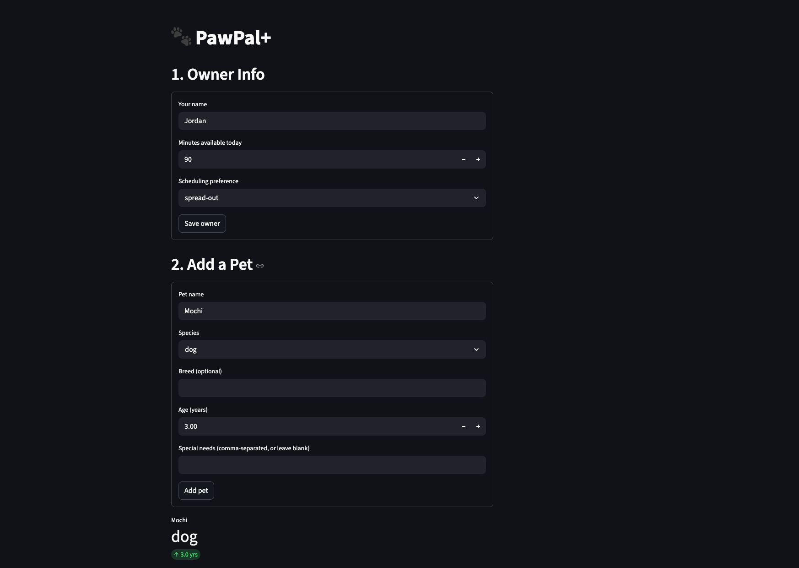

# PawPal+ (Module 2 Project)

You are building **PawPal+**, a Streamlit app that helps a pet owner plan care tasks for their pet.

## Scenario

A busy pet owner needs help staying consistent with pet care. They want an assistant that can:

- Track pet care tasks (walks, feeding, meds, enrichment, grooming, etc.)
- Consider constraints (time available, priority, owner preferences)
- Produce a daily plan and explain why it chose that plan

Your job is to design the system first (UML), then implement the logic in Python, then connect it to the Streamlit UI.

## What you will build

Your final app should:

- Let a user enter basic owner + pet info
- Let a user add/edit tasks (duration + priority at minimum)
- Generate a daily schedule/plan based on constraints and priorities
- Display the plan clearly (and ideally explain the reasoning)
- Include tests for the most important scheduling behaviors

## 📸 Demo

<a href="demo.png" target="_blank">
  
</a>

---

## Features

| Feature | Description |
|---|---|
| **Pet profiles** | Register multiple pets with name, species, breed, age, and special needs |
| **Task management** | Add care tasks (walks, feeding, medication, grooming, enrichment) with priority, duration, preferred time window, and frequency |
| **Priority-first scheduling** | Generates a daily plan by selecting tasks high → medium → low priority until the owner's time budget is exhausted |
| **Time-window ordering** | Scheduled tasks are sorted into morning, afternoon, and evening slots and assigned concrete `HH:MM` start times |
| **Sorting by start time** | Any task list can be re-sorted chronologically via `Scheduler.sort_by_time()` |
| **Flexible filtering** | Filter tasks by pet name, completion status, or both using `Scheduler.filter_tasks()` |
| **Conflict detection** | `Scheduler.detect_conflicts()` compares overlapping task windows and surfaces plain-language warnings in the UI before the plan is displayed |
| **Recurring task reset** | Daily and weekly tasks auto-generate their next occurrence (via Python `timedelta`) when marked complete — no manual re-entry needed |
| **Plan explanation** | Every generated plan includes a human-readable narrative explaining which tasks were scheduled, which were skipped, and why |
| **19 automated tests** | `pytest` suite covers happy paths and edge cases: empty pets, zero budgets, exact-time conflicts, recurrence boundaries |

## Getting started

### Setup

```bash
python -m venv .venv
source .venv/bin/activate  # Windows: .venv\Scripts\activate
pip install -r requirements.txt
```

## Testing PawPal+

```bash
python3 -m pytest tests/ -v
```

The test suite has **19 tests** across `tests/test_pawpal.py`, grouped into:

| Group | What it covers |
|---|---|
| **Task completion** | `mark_complete()` flips status; idempotent on double-call |
| **Pet task management** | Adding tasks increases count correctly |
| **Scheduler — happy path** | High-priority tasks scheduled first; budget enforced; completed tasks excluded |
| **Sorting** | `sort_by_time()` orders by HH:MM; tasks without a start time sort last |
| **Filtering** | `filter_tasks()` by pet name and by completion status |
| **Conflict detection** | Overlapping windows flagged; exact-same start time flagged; adjacent (non-overlapping) tasks pass |
| **Recurring tasks** | `next_occurrence()` returns correct due date; non-recurring returns `None`; `reset_recurring_tasks()` replaces completed copies |
| **Edge cases** | Pet with no tasks produces empty plan; zero-minute budget skips everything |

**Confidence level: ★★★★☆**
Core scheduling behaviors are well-covered. Edge cases not yet tested include: tasks whose duration exactly equals the remaining budget, weekly recurrence across a month boundary, and owners with no pets registered.

---

## Smarter Scheduling

Beyond the basic priority-first plan, PawPal+ includes four algorithmic enhancements:

| Feature | How it works |
|---|---|
| **Time-based sorting** | `Scheduler.sort_by_time()` sorts any task list by `HH:MM` start time using a `lambda` key, placing tasks without a start time last. |
| **Flexible filtering** | `Scheduler.filter_tasks()` accepts optional `pet_name` and `completed` arguments, letting the UI or scripts slice the task list without extra loops. |
| **Recurring task reset** | When a recurring task is marked complete, `next_occurrence()` returns a fresh copy due the next day (or week). `reset_recurring_tasks()` sweeps all pets and performs the swap automatically using Python's `timedelta`. |
| **Conflict detection** | `detect_conflicts()` checks for overlapping task windows by comparing each task's `start_time + duration_minutes` against the start of the next task. Returns human-readable warnings rather than raising exceptions. |

`generate_plan()` automatically assigns sequential `HH:MM` start times within each time window (morning from 07:00, afternoon from 12:00, evening from 17:00) so that conflict detection has concrete timestamps to compare.

---

### Suggested workflow

1. Read the scenario carefully and identify requirements and edge cases.
2. Draft a UML diagram (classes, attributes, methods, relationships).
3. Convert UML into Python class stubs (no logic yet).
4. Implement scheduling logic in small increments.
5. Add tests to verify key behaviors.
6. Connect your logic to the Streamlit UI in `app.py`.
7. Refine UML so it matches what you actually built.
